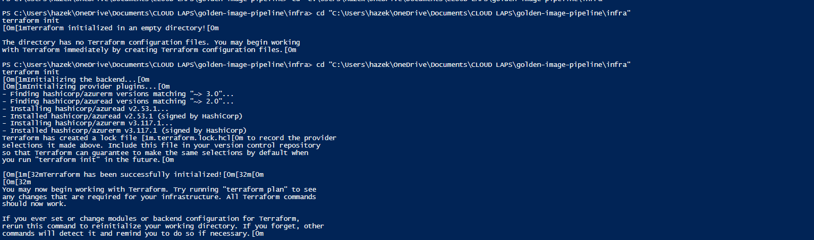
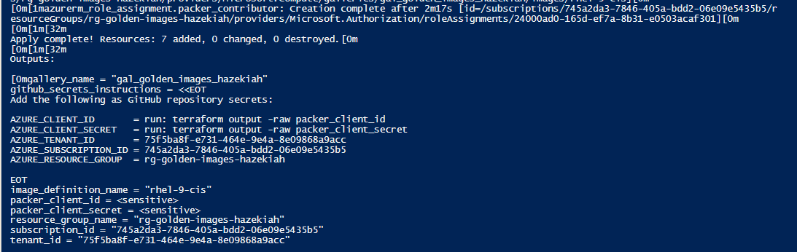
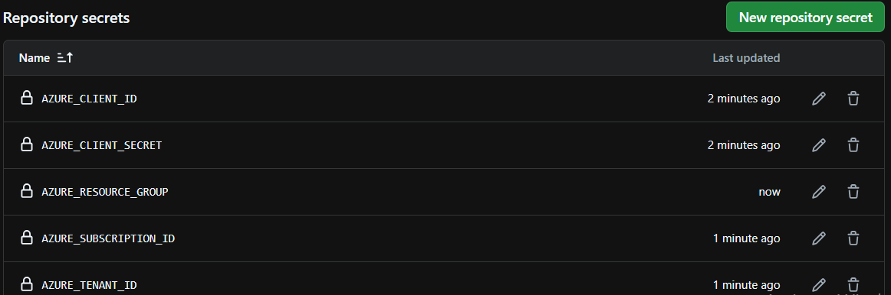
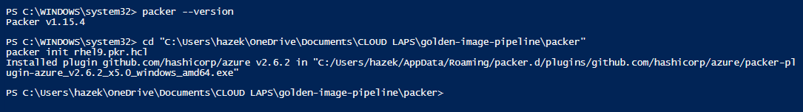
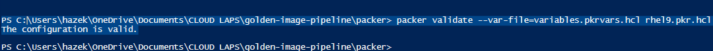
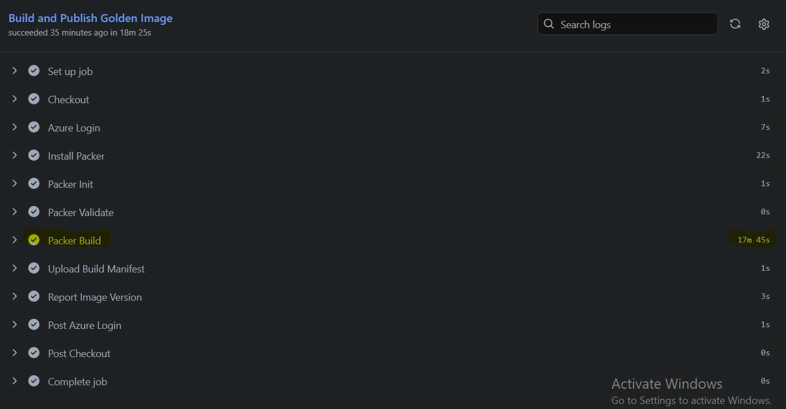
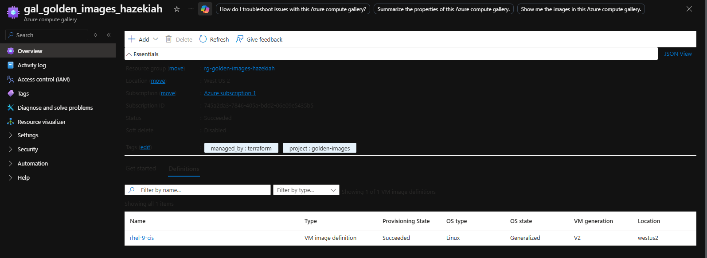
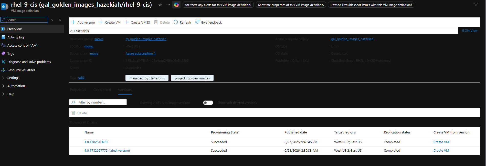
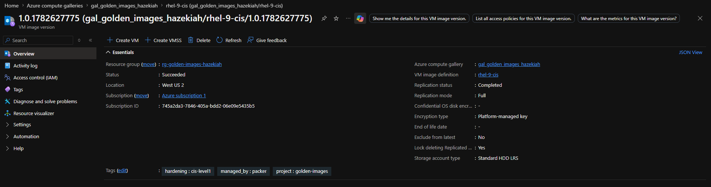
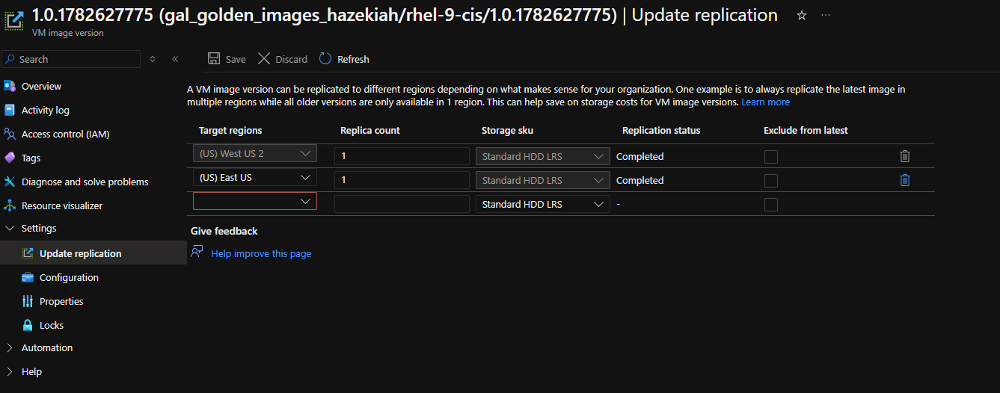

# DevSecOps Lab: Automated Golden VM Image Pipeline

## Overview

This lab builds a fully automated pipeline that produces a **CIS Level 1 hardened RHEL 9 VM image** on a weekly schedule using **Packer**, **Terraform**, and **GitHub Actions**. The finished image is stored in an **Azure Compute Gallery** and replicated across two regions (West US 2 and East US), ready to be used as a secure baseline for any VM deployment.

---

## Architecture

```
GitHub Actions (weekly schedule / manual trigger)
        │
        ▼
Packer Build Runner (Ubuntu, GitHub-hosted)
        │
        ├── Azure Login (Service Principal)
        ├── packer init / validate
        └── packer build
                │
                ▼
        Temp Build VM (Standard_D2s_v3, westus2)
                │
                ├── dnf update
                ├── hardening.sh  (CIS Level 1: SELinux, SSH, auditd, firewalld, sysctl)
                └── cleanup.sh    (SSH keys, cloud-init, machine-id, dnf cache)
                        │
                        ▼
        Managed Image → Azure Compute Gallery
                        ├── West US 2 (primary)
                        └── East US   (replica)
```

---

## Tech Stack

| Tool | Purpose |
|---|---|
| Terraform | Provisions resource group, compute gallery, image definition, service principal |
| Packer | Builds and captures the hardened VM image |
| GitHub Actions | Automates weekly builds via scheduled workflow |
| Azure Compute Gallery | Stores and replicates versioned VM images |
| RHEL 9 (LVM Gen2) | Base image — CIS Level 1 hardened |
| Shell Scripts | CIS hardening and pre-capture cleanup |

---

## Repository Structure

```
golden-image-pipeline/
├── .github/
│   └── workflows/
│       └── build-golden-image.yml   # GitHub Actions workflow
├── images/                          # Lab screenshots
├── infra/
│   ├── main.tf                      # Resource group, gallery, SP, role assignment
│   ├── variables.tf
│   ├── outputs.tf
│   ├── terraform.tfvars             # (gitignored)
│   └── terraform.tfvars.example
└── packer/
    ├── rhel9.pkr.hcl                # Packer template
    ├── variables.pkrvars.hcl        # (gitignored)
    ├── variables.pkrvars.hcl.example
    └── scripts/
        ├── hardening.sh             # CIS Level 1 controls
        └── cleanup.sh               # Pre-capture cleanup
```

---

## Prerequisites

- Azure CLI installed and authenticated (`az login`)
- Terraform >= 1.3
- Packer >= 1.10 (`choco install packer -y` on Windows)
- GitHub repository with Actions enabled

---

## Deployment Steps

### Part 1 — Terraform Infrastructure

```bash
cd infra
terraform init
terraform apply -auto-approve
```

**Resources created (7 total):**
- Resource group: `rg-golden-images-hazekiah`
- Azure Compute Gallery: `gal_golden_images_hazekiah`
- Image definition: `rhel-9-cis`
- AAD Application
- Service Principal
- Service Principal Password
- Role Assignment (Contributor on resource group)

After apply, retrieve the secret values for GitHub:

```bash
terraform output -raw packer_client_id
terraform output -raw packer_client_secret
```




---

### Part 2 — GitHub Secrets

Navigate to your repo → **Settings → Secrets and variables → Actions** and add:

| Secret | Value |
|---|---|
| `AZURE_CLIENT_ID` | `terraform output -raw packer_client_id` |
| `AZURE_CLIENT_SECRET` | `terraform output -raw packer_client_secret` |
| `AZURE_TENANT_ID` | `terraform output -raw tenant_id` |
| `AZURE_SUBSCRIPTION_ID` | `terraform output -raw subscription_id` |
| `AZURE_RESOURCE_GROUP` | `rg-golden-images-hazekiah` |



---

### Part 3 — Packer Validate (Local)

```bash
cd packer
packer init rhel9.pkr.hcl
packer validate --var-file=variables.pkrvars.hcl rhel9.pkr.hcl
```




---

### Part 4 — GitHub Actions Workflow

Trigger manually: **Actions → Build Golden VM Image → Run workflow**

The workflow runs automatically every Sunday at 2 AM UTC.

Build time: approximately 7–8 minutes end to end.



---

## Azure Portal Results






---

## CIS Level 1 Hardening Applied

| Category | Controls |
|---|---|
| Filesystem | Disabled cramfs, freevxfs, jffs2, hfs, hfsplus, squashfs, udf |
| SELinux | Enforcing mode, targeted policy |
| SSH | Protocol 2, no root login, no password auth, 4 max auth tries, X11 disabled |
| Password Policy | 14 char min, 4 complexity classes, 365 day max age |
| Auditd | Identity changes, sudoers, SSH config, SELinux, setuid exec |
| Firewalld | Default zone drop, SSH only |
| Network | IP forwarding off, IPv6 disabled, syncookies on, redirects off |
| Services | Disabled avahi, cups, dhcpd, slapd, nfs, rpcbind, vsftpd, httpd, dovecot, smb, squid, snmpd |
| Banner | Login warning banner on /etc/issue, /etc/issue.net, /etc/motd |

---

## Troubleshooting Log

This lab required 6 workflow iterations to reach a successful build. All errors and fixes are documented below.

---

### Error 1 — Wrong `image_publisher` in Packer Template

**Error:** Packer template had `image_publisher = "Canonical"` — that's Ubuntu, not RHEL.

**Fix:** Changed to `image_publisher = "RedHat"` in `rhel9.pkr.hcl`.

---

### Error 2 — `application_id` Deprecated in azuread v2

**Error:** Terraform `main.tf` used `application_id` on the `azuread_service_principal` and `azuread_service_principal_password` resources, which is deprecated in azuread provider v2+.

**Fix:** Replaced `application_id` with `client_id` on the service principal resource, and referenced `object_id` on the password resource.

---

### Error 3 — `azure/login@v1` Does Not Support `client-secret`

**Error:**
```
Login failed with Error: Unable to get ACTIONS_ID_TOKEN_REQUEST_URL env variable.
Unexpected input(s) 'client-secret'
```

**Fix:** Upgraded to `azure/login@v2` and switched to the `creds` JSON format:
```yaml
with:
  creds: '{"clientId":"...","clientSecret":"...","subscriptionId":"...","tenantId":"..."}'
```

---

### Error 4 — `variables.pkrvars.hcl` Not Found in Workflow

**Error:**
```
The configuration file "variables.pkrvars.hcl" could not be read.
```

**Cause:** `variables.pkrvars.hcl` is gitignored (contains subscription ID) so it never existed on the GitHub Actions runner.

**Fix:** Removed `-var-file=variables.pkrvars.hcl` from both the Packer Validate and Packer Build steps in the workflow. All variables are now passed via `PKR_VAR_` prefixed environment variables sourced from GitHub Secrets.

---

### Error 5 — OS Disk Size Too Small

**Error:**
```
OperationNotAllowed: The specified disk size 30 GB is smaller than the size
of the corresponding disk in the VM image: 64 GB.
```

**Cause:** `os_disk_size_gb = 30` was set in the Packer template. RHEL 9 LVM Gen2 requires a minimum of 64 GB.

**Fix:** Removed `os_disk_size_gb` entirely from `rhel9.pkr.hcl` to allow Azure to use the image default (64 GB).

---

### Error 6 — `/var/lib/dbus` Directory Does Not Exist on RHEL 9

**Error:**
```
ln: failed to create symbolic link '/var/lib/dbus/machine-id': No such file or directory
```

**Cause:** The `cleanup.sh` script attempted to create a symlink at `/var/lib/dbus/machine-id` but the `/var/lib/dbus/` directory does not exist on RHEL 9 — it's a Debian/Ubuntu convention.

**Fix:** Added a directory existence check before attempting the symlink:
```bash
truncate -s 0 /etc/machine-id
if [ -d /var/lib/dbus ]; then
  rm -f /var/lib/dbus/machine-id
  ln -s /etc/machine-id /var/lib/dbus/machine-id
fi
```

---

## Teardown

```bash
cd infra
terraform destroy -auto-approve
```

This removes all 7 resources including the compute gallery, image definitions, and service principal. Image versions must be deleted manually from the portal before the gallery can be destroyed, or use:

```bash
az sig image-version delete \
  --resource-group rg-golden-images-hazekiah \
  --gallery-name gal_golden_images_hazekiah \
  --gallery-image-definition rhel-9-cis \
  --gallery-image-version <version>
```

---

## Key Takeaways

- Packer and Terraform are complementary — Terraform manages persistent Azure infrastructure, Packer manages the ephemeral build VM and image capture
- The `build_resource_group_name` attribute is required when using an existing resource group; without it Packer tries to create a temp resource group and fails on authorization
- `PKR_VAR_` environment variables are the correct way to pass secrets to Packer in CI/CD — never commit `.pkrvars.hcl` files
- CIS Level 1 hardening on RHEL 9 via shell provisioners is portable and auditable — no third-party tools required
- Azure Compute Gallery supports multi-region replication natively, making hardened images available close to any deployment region
